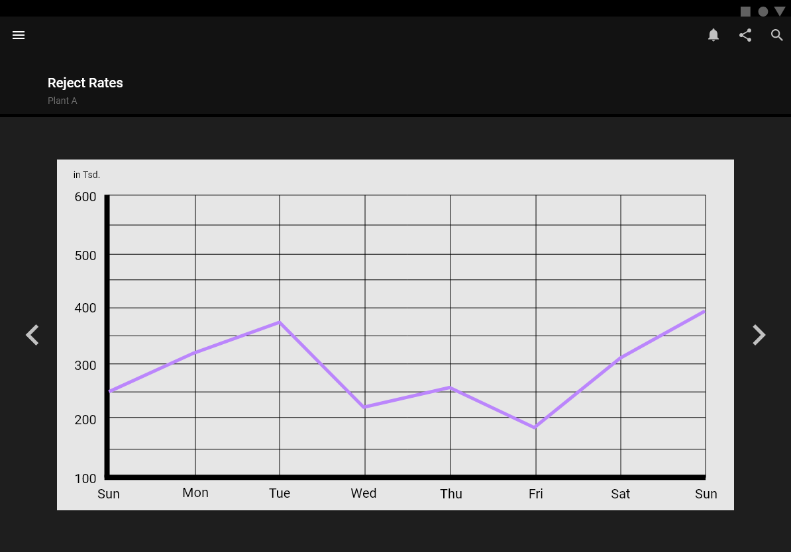
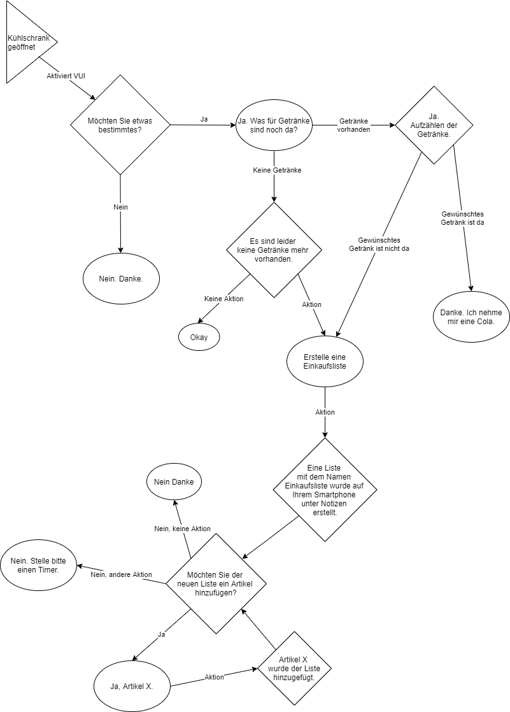

# Interactive Design Course

---

 
[<b>Wallet Project</b>](Task_01/task01.md) 
Design eines individualisierten Geldbeutels

---

<video width="100" controls loop>
  <source src="Task_02/preview.mp4" type="video/mp4">
</video> 
[<b>GUI</b>](Task_02/task02.md) 
Design eines App-Prototypen 
 
<video width="100" controls loop>
  <source src="Task_03/SmartwatchProto.mp4" type="video/mp4">
</video> 
[<b>Responsive Design</b>](Task_03/task03.md) 
Design einer Smartwatch und Tablet Variante 
 
 
[<b>Design Transformation Challenge</b>](Task_04/task04.md) 
Veränderung des Designs nach Material Design Richtlinien

---

 
[<b>VUI Entwurf</b>](Task_05/task05.md) 
Entwerfen eines Voice User Interface 
 
[<b>VUI Prototyp</b>](Task_06/task06.md) 
Umsetzen eines Voice User Interface 
 
[<b>Testing</b>](Task_07/task07.md) 
Probandentests zum Vergleich von VUIs

---

 
[<b>IoT Koncept</b>](Task_08/task08.md) 
Konzipieren einer Interaktion mit ESP32 
 
 
[<b>IoT Umsetzung</b>](Task_09/task09.md) 
Entwickeln eines Reaktionsspiels

---
