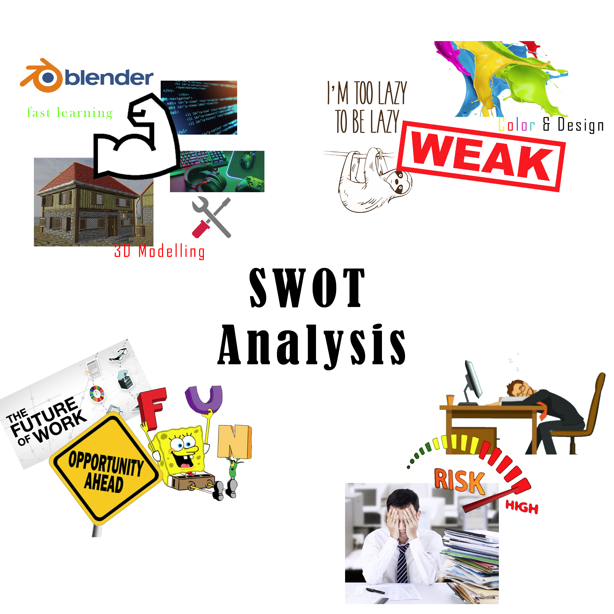

# Interactive Design Course

---

## Task #00

  
SWOT Analyse

   
  
  
  
   

 

---

## Task #01

  
Wallet Project

   

  <h3>Geldbeutel für Ben Ruff</h3>

   

  <b>Empathize</b>
   
  Fragen im Interview: 
  1. Wie sieht der aktuelle Geldbeutel aus? 
  2. Wie wird er hauptsächlich genutzt? 
  3. Was muss unbedingt im Geldbeutel sein? 
  4. Wie wird er aufbewart/transportiert? 
  5. Welche Probleme gibt es? 
  6. Welche Wünsche gibt es? 
  7. Was sind die wichtigsten Features? 
  8. Gibt es Unnötiges? 
  9. Gewünschte Form? 
  10. Gewünschte Farbe? 
  11. Gewünschtes Material? 
   

  <b>Define:</b> Es wird ein Zweitgeldbeutel gebraucht, der extrem reduziert ist. Der neue Geldbeutel wird nur zum Saufen gehen verwendet und sollte daher möglichst wenige Karten und nur minimal Geld beinhalten. Dabei sollte er besonders klein sein, sodass er nicht stört und sicher verstaut, sodass er nicht verloren geht.
   
  <i>Wünsche:</i> Hordelogo, NFC-Schutz.
   
   

  <b>Ideate</b>

  Möglichst kleine, unauffällige Methoden genug Geld für einen Abend sicher zu verstauen:

  

   
   

  <b>Prototype:</b>
   
  Geldbeutel aus Spezialpapier in der Größe einer Geldkarte. Aufklappbar(Magnetstreifen zum Schließen), um so dünn wie möglich zu sein. Platz für 2 Münzen für eventuelles Rückgeld. Ohne Münzen dünn genug um ihn in einer Handyhülle zu verstauen.

  

   
   
  
  <b>Test/Feedback:</b>
   
  Gutes Gesamtkonzept. Spezialpapier sehr gut, da modern.
  WoW-Icon sollte ein Horde-Icon sein.
  

  <b>Prototype Iteration</b>

  
  
  
  
  
  

 

---
