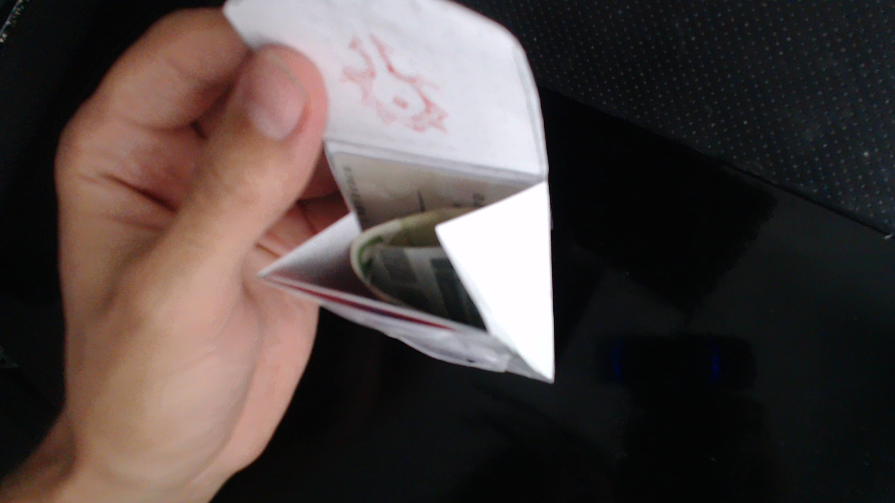

# Interactive Design Course

---

## Task #00

  
SWOT Analyse

   
  
  
  
   

 

---

## Task #01

  
Wallet Project

   

  ### Geldbeutel für Ben Ruff

   

  **Interview**

  *Bisheriger Geldbeutel:* Dicker Ledergeldbeutel, der in einer vorderen Hosentasche getragen wird.
   
   
  *Ergebnis:* Es wird ein Zweitgeldbeutel gebraucht, der extrem reduziert ist. Der neue Geldbeutel wird nur zum Saufen gehen verwendet und sollte daher möglichst wenige Karten und nur minimal Geld beinhalten. Dabei sollte er besonders klein sein, sodass er nicht stört und sicher verstaut, sodass er nicht verloren geht.
   
   
  *Wünsche:* Hordelogo, NFC-Schutz.
   
   

  **Ideenfindung**

  Möglichst kleine, unauffällige Methoden genug Geld für einen Abend sicher zu verstauen:

  

   
   

  *Finalisierung einer Idee:*
   
  Geldbeutel aus Spezialpapier in der Größe einer Geldkarte. Aufklappbar(Magnetstreifen zum Schließen), um so dünn wie möglich zu sein. Platz für 2 Münzen für eventuelles Rückgeld. Ohne Münzen dünn genug um ihn in einer Handyhülle zu verstauen.

  

   
   

  **Prototyp**

  
  
  
  
  
  

</detais>
 

---
