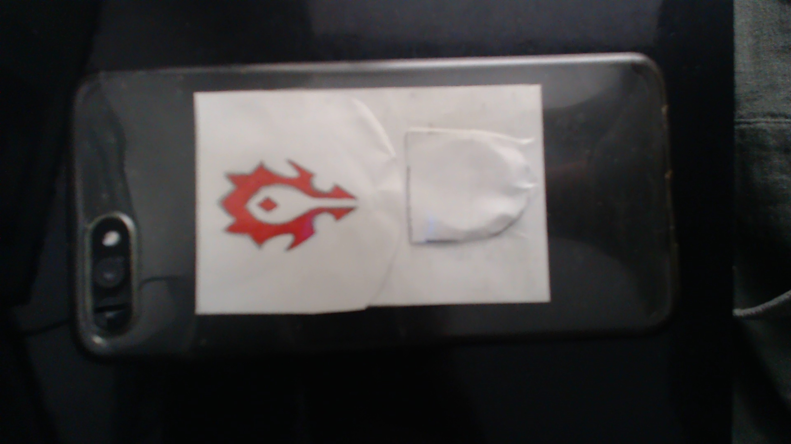

# Interactive Design Course

---

 
[<b>Wallet Project</b>](Task_01/task01.md) 
Design eines individualisierten Geldbeutels

---

<video width="50" controls loop>
  <source src="Task_02/preview.mp4" type="video/mp4">
</video> 
[<b>GUI</b>](Task_02/task02.md) 
Design eines App-Prototypen

---

[Task03](Task_03/task03.md)

---

[Task04](Task_04/task04.md)

---

[Task05](Task_05/task05.md)

---

[Task06](Task_06/task06.md)

---

[Task07](Task_07/task07.md)

---

[Task08](Task_08/task08.md)

---

[Task09](Task_09/task09.md)

---
