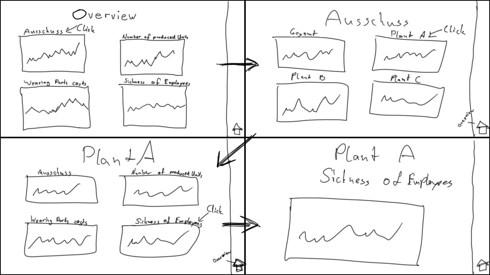

## Task #02
 
  <h3>GUI</h3>
   
  
  <b>Task</b>
   
  Erstellen eines GUI für ein Unternehmen basierend auf deren Anforderungen. 
  
  <b>Briefing</b>
   
  <code>Our management receives all relevant data of our plants (Werke) from controlling as an excel file. 
  Our secretary processes this excel data to diagrams and copies the excel file on our big touch screen in the main conference room for daily meetings. 
  We need a contemporary solution! A sophisticated, interactive presentation system of our production figures for discussions. 
  The excel file provides the following information: 
  the number of produced units, 
  the reject rates (Ausschuss), 
  costs for wearing parts (Kosten für Verschleißteile) and 
  sickness notifications of employees. 
  We get this data from all three plants every day at 10:00 p.m. (Note: screen resolution: FullHD)</code>
   
   
  
  <b>Define</b>
   
   
  Wichtige Daten: 
  - Reject Rates
  - Number of produced units
  - Cost for wearing parts
  - Employee Sickness
  
  Das Unternehmen braucht eine übersichtliche, leicht zu navigierende Oberfläche. 
  Die wichtigen Daten müssen in Ansichten sinnvoll gruppiert werden. 
   
  
  <b>Ideate</b>
   
   
  Sinvolle Gruppierung der Daten:
  - Gesamtübersicht
  - Übersicht für einzelne Werke
  - Übersicht für einzelne Daten
   
  
  Navigation:
  - Home
  - Zurück
   
   
  
  <b>Low-Fid</b>
   
   
  
