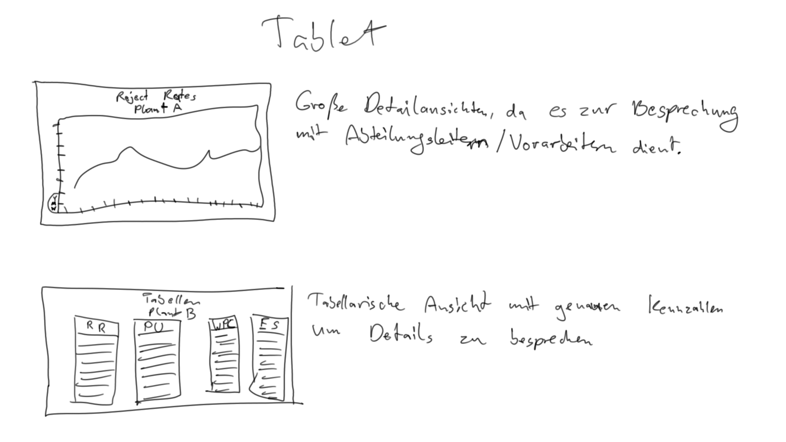
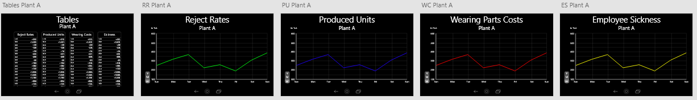

## Task #03
 
  <h3>Responsive Design Challenge</h3>
   
  
  <b>Task</b>
   
  Erstellen einer Version des bisherigen GUI für Smartwatches und Tablets. 
  
  <h3>Smartwatch</h3>
   
  <b>Briefing</b>
   
  Last week we presented the big screen systems to our Vice President and Senior Directors. 
  We came up with the idea to run this system on our smartwatches. 
  You know, this would be a great activity in our digital transformation to promote our company. 
  We need a proof of concept for the upcoming fair presentation next summer.
   
   
  
  <b>Define</b>
   
   
  Die Smartwatch Version soll auf den Uhren der Management-Ebene laufen.
  Es sollten aktuelle Veränderungen aufgezeigt werden, die eventuelle Aktionen im Management verlangen. 
   
  <i>Primäre Informationen:</i>
  - aktuelle Veränderungen
  - Gesamtübersichten
   
  <i>Sekundäre Informationen:</i>
  - Detailierte Datenverläufe
   
   
  
  <b>Low-Fid</b>
   
   
  
   
  Aktuelle Differenzen zur letzten Woche/Monat/Jahr. 
  Unterteilungsmöglichkeit nach Werken und Daten. 
   
  
  <b>Medium/High-Fid</b>
   
   
  <video controls loop>
      <source src="SmartwatchProto.mp4" type="video/mp4">
  Ihr Browser kann dieses Video nicht wiedergeben. 
  Sie können es <a href="SmartwatchProto.mp4">hier</a> abrufen.
  </video>
   
   
  Übersicht über alle Seiten 
  
   
   
  Differenz Übersicht 
  
   
   
  <h3>Tablet</h3>
   
  <b>Briefing</b>
   
  There are some use-cases where the location-based screen in the meeting room is not sufficient: 
  when meetings take place in another office, 
  for instance when discussions about the plant production numbers are discussed directly on the production line with the foremen and ciefs. 
  Thus, we need an adaptation of this big screen systems for tablets.
   
   
  
  <b>Define</b>
   
   
  Die Tablet Version ist nicht dafür da, auf Management-Ebene eine Übersicht zu geben, 
  sondern um in spezifischen Werken mit Arbeitern und Projektleitern den aktuellen Stand zu diskutieren. 
   
  <i>Primäre Informationen:</i>
  - detailierte Daten
  - Werkspezifische Daten
   
  <i>Sekundäre Informationen:</i>
  - Gesamtübersichten
   
   
  
  <b>Low-Fid</b>
   
   
  
   
  Übersicht zu den Werksdaten mit Graphen. 
  Genaue Daten in tabellarischer Ansicht. 
   
  
  <b>Medium/High-Fid</b>
   
   
  <video controls loop>
      <source src="TabletProto.mp4" type="video/mp4">
  Ihr Browser kann dieses Video nicht wiedergeben. 
  Sie können es <a href="TabletProto.mp4">hier</a> abrufen.
  </video>
   
   
  Übersicht über alle Seiten 
  
   
   
  Tabellarische Ansicht 
  
   
   
  Graphische Ansicht 
  
