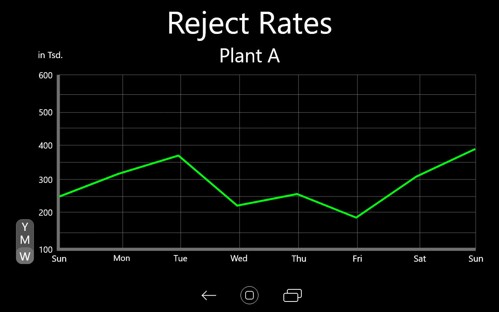

## Task #04
 
  <h3>Design Transformation Challenge</h3>
   
  
  <b>Task</b>
   
  Anpassen eines bisherigen Screens an das Material Design von Google. 
   
  <b>Bisheriger Screen</b> 
  
   
   
  
  <b>Angepasster Screen</b>
  
