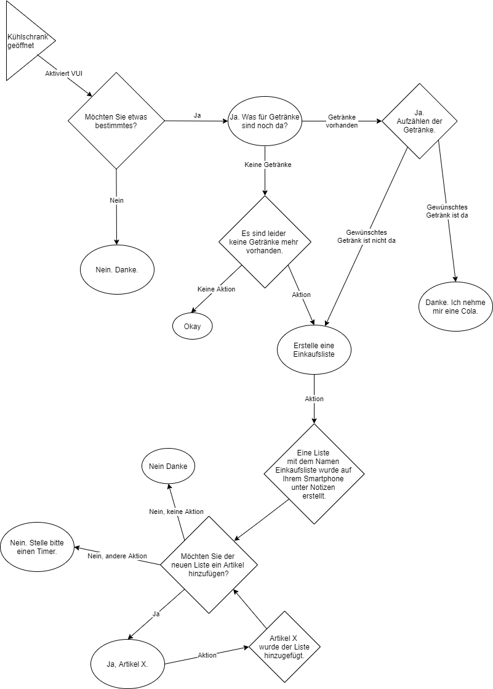

## Task #05
 
  <h3>Prototype a Voice User Interface</h3>
   
  
  <b>Task</b>
   
  Erstellen eines Voice User Interface, welches auf "Push Notifications" anstelle von "Wake Words" zurückgreift. 
   
  <b>Briefing</b> 
  <i>Take a scenario from everyday life a create a concept for a voice-based push notification. After the notification the user should be able to drill deeper into the information and start a conversation with the assistance. Draw a rough storyboard of your concept.</i>
   
   
  
  <b>Storyboard</b> 
  
  <i>Trigger:</i> Kühlschrank wurde geöffnet. 
  <i>VUI:</i> "Möchten Sie etwas bestimmtes?" 
  <i>User:</i> "Ja. Was für Getränke sind noch da?" 
  <i>VUI:</i> "Es gibt noch eine angefangene Packung Milch und eine volle und eine angefangene Packung Orangensaft." 
  <i>User:</i> "Habe ich noch Softdrinks?" 
  <i>VUI:</i> "Nein. Sie haben gerstern die letzte Flasche Cola aufgebraucht." 
  <i>User:</i> "Erstelle bitte einen Einkaufszettel." 
  <i>VUI:</i> "Eine Liste mit dem Namen 'Einkaufszettel' wurde auf Ihrem Smartphone unter Notizen erstellt." 
  <i>User:</i> "Füge der Liste 1 sixpack Cola hinzu." 
  <i>VUI:</i> "1 sixpack Cola wurde der Liste 'Einkaufsliste' hinzugefügt. Möchten Sie der Liste noch mehr hinzufügen?" 
  <i>User:</i> "Ja. Füge 4 mal 'Joghurt mit der Ecke'hinzu. Außerdem Salami und Käse." 
  <i>VUI:</i> "4 mal 'Joghurt mit der Ecke', 'Salami' und Käse' wurden der Liste 'Einkaufsliste' hinzugefügt. Möchten Sie der Liste noch mehr hinzufügen?" 
  <i>User:</i> "Nein. Stelle einen Timer auf 16 Uhr mit dem Namen 'Einkaufen'." 
  <i>VUI:</i> "Ein Timer mit dem Namen 'Einkaufen' wurde auf 16 Uhr gestellt." 
   
  <b>Dialog Flow</b> 
  
  
