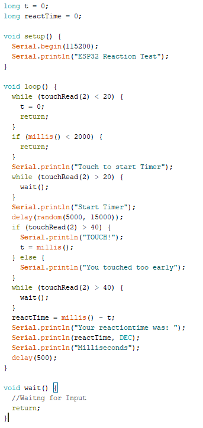
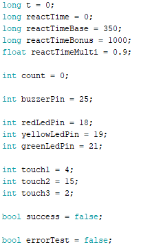
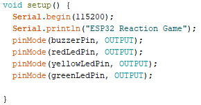
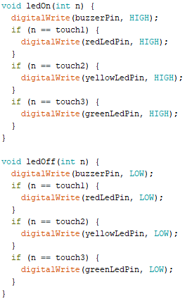

## Task #09
 
<h1>Erstellen eines <b>Reaktions Spiels</b></h1> 
<h2>Aufgabe</h2>
Das Ziel dieser Aufgabe ist es, eine interessante Interaktion zu entwerfen, unter Zuhilfenahme eines ESP32. Ich habe mich dafür entschieden, ein Spiel zu kreieren, welches auf der Reaktionsschnelligkeit des Spielers beruht. 
 
<h2>Konzept</h2>
Das Spiel besteht aus 3 unterschiedlich farbigen LEDs und jeweils einem zugehörigen Button. Sobald ein Buzzer ertönt, leuchtet eine der LEDs auf und der Spieler muss innerhalb eines gewissen Zeitraums den zugehörigen Button drücken. Schafft er es, wiederholt sich das Spiel mit einer kürzerer Zeit zu reagieren. Um dem Spieler nicht zu schnell zu überfordern, wird von der Reaktionszeit nicht linear sondern prozentual abgezogen. Ziel ist es, so viele Durchgänge wie möglich zu schaffen. 
 
<h2>Testphase</h2>
Da ich bisher noch nie mit einem ESP oder Arduino gearbeitet habe, möchte ich als ersten Test, um mit der Funktionsweise vertraut zu werden, einen generellen Reaktionstest bauen. Dafür brauche ich nur einen Button und den ESP32. Dieser Test dient auch dazu, direkt die wichtigste Funktion des Spiels, das Messen der Reaktionszeit, zu testen. 
<b>hier Bild des Aufbaus</b>
 
Mit diesem simplen Aufbau und Skript konnte ich einen Reaktionstest realisieren, der die Reaktionszeit des Users in Millisekunden ausgibt. Nach einer zufälligen Zeit zwischen 5 und 15 Sekunden wird der User aufgefordert, den Button zu berühren. Anschließend die Zeit von der Aufforderung bis zur Berührung gemessen und ausgegeben. 
<h2>Entwicklung des Spiels</h2>
<h3>Software</h3>
Um die unterschiedlichen LEDs, den Buzzer, die Touchinputs und die Spielfunktionen wie das Tracken der Rundenzahl musste ich viele neue Varablen deklarieren, die ich zum reinen Messen der Reaktionszeit noch nicht gebraucht hatte. 
 
Außerdem müssen die Pins, die die LEDs und den Buzzer mit Strom versorgen als Output gekennzeichnet sein. Da diese Kennzeichnung bei den Touch Inputs, die ich beim Testen gebraucht habe nicht notwenidig war, wusste ich erst nichts davon. Daher haben die LEDs und der Buzzer überhaupt nicht funktioniert und ich musste erst nach der Fehlerquelle suchen.
 
Um eine einfache Methode zu haben, eine bestimmte LED ein- und auszuschalten, habe ich direkt eine Funktion dafür geschrieben, die ich dann nach belieben im Skript aufrufen kann. Da der Buzzer immer gleichzeitig mit den LEDs an ist, habe ich ihn auch direkt in die Funktion integriert.
 
